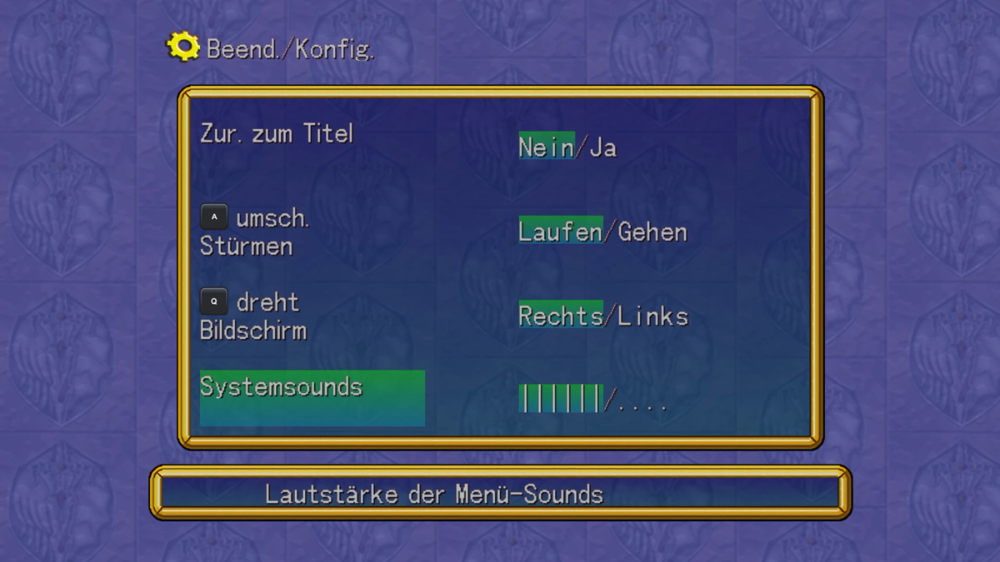

# GranasSabre 0.1-beta – Menu sound volume bar for Grandia II



**Download:** see [Releases](../../releases). Get `GranasSabre-0.1-beta.zip`, not the source code archive.

> **Antivirus warnings:** 5 of 71 scanners on VirusTotal flag the exe (DeepInstinct, Elastic, SecureAge, Skyhigh, Zillya). These are heuristic/machine-learning engines. Microsoft Defender, Kaspersky, ESET, Bitdefender, Avast, Malwarebytes and the other major ones report it as clean. This is a known issue with tools packed by PyInstaller: the exe unpacks a Python interpreter at startup, which some engines treat as suspicious. The complete source code is included, and you can run `GranasSabre.py` with Python 3.8+ instead of the exe. Your call. [VirusTotal report](https://www.virustotal.com/gui/file/17f08df32f6e07aa35dee4f8c012bab52afef6acc30cdd08f223ce458f1af746)

*Deutsch weiter unten.*

> **Beta – testers with the Steam version wanted!**
> GranasSabre has been tested on one build of `grandia2.exe` (2020-07-31).
> Please run `GranasSabre.exe` → **B** (beta test report), or
> `GranasSabre report`, and post the block it prints. It contains no personal
> data. If the tool says your version is unknown but "all patch locations
> match", you can try `GranasSabre patch --allow-unknown`. Restore works the
> same way.
>
> **Beta – Tester mit der Steam-Version gesucht!** Bitte `GranasSabre.exe` → **B**
> ausführen und den ausgegebenen Block posten.

## English

### What it does
In Grandia II HD Remaster / Anniversary Edition (PC), the menu sounds (cursor,
confirm, cancel) are far too loud compared with music and voices. Every sound
file is normalised to full level, and the short menu clicks get the full SFX
volume.

GranasSabre adds a fourth row **"System sounds"** with a volume bar to the
in-game config menu:

```
Menu → Quit/Config → System sounds   ||||||/....
```

- **Left/Right** makes the menu sounds quieter or louder, in 10 steps of 3 dB.
  Step 0 is mute, step 10 is the original volume.
- The change is applied immediately and **stored in your save file**.
- Saves without a setting use step 6 (−12 dB).
- Music, voices and all other sound effects are not affected.

The tool patches **your own** `grandia2.exe` and the menu text files locally.
No game files are included or distributed.

### Requirements
- Windows
- A supported, unmodified `grandia2.exe`. GranasSabre checks the SHA-256 hash
  and refuses unknown versions without changing anything.

### Install
1. Close the game.
2. Copy the `GranasSabre` folder into your game folder, next to `grandia2.exe`.
   In Steam: right-click the game → *Manage* → *Browse local files*.
3. Double-click `GranasSabre.exe` and choose **P** (patch). Press Enter to accept
   the default step, or type a step from 0 to 10.
4. Start the game, load a save, open the menu → *Quit/Config*.

Originals are saved to `<game>\GranasSabre\backup\`.

### Uninstall
Run `GranasSabre.exe` and choose **R** (restore). This restores the original
EXE and text files and deletes the backup. Alternatively use Steam → *Verify
integrity of game files*. After that you can delete the `GranasSabre` folder.

The setting stays in your save files, where it is harmless: the original game
ignores it.

### Notes
- **Steam updates and "Verify integrity of game files" remove the patch.**
  Run GranasSabre again afterwards. If an update changed the EXE, GranasSabre
  refuses to patch until it has been updated for the new version.
- `GranasSabre.exe status` shows the current state.
- Some antivirus programs flag tools built with PyInstaller. The full source
  code is included as `GranasSabre.py`. It runs with Python 3.8+ and does
  exactly the same as the EXE.

### Command line

```
GranasSabre patch   [--game-dir DIR] [--default-level 6] [--step-db 3] [--ids 1,2,3]
GranasSabre restore [--game-dir DIR]
GranasSabre status  [--game-dir DIR]
GranasSabre report  [--game-dir DIR]
```

| Option | Meaning |
|---|---|
| `report` | Prints compatibility info to share: hash, build date, patch locations. No personal data. |
| `--allow-unknown` | Patch an unknown EXE version, but only if all patch locations match byte for byte |
| `--default-level 6` | Bar step for saves without a setting (0–10) |
| `--step-db 3` | Volume change per bar step in dB |
| `--ids 1,2,3` | Sound IDs controlled by the bar (default cursor, confirm, cancel) |
| `--ids all` | All 21 system sounds (menus, item/gold pickup, level up, encounter jingle, …) |

The game folder is found automatically: first the tool's folder and its parent,
then the current folder, then your Steam libraries (App ID 330390).

### Technical details
- The game computes the volume of every sound in one function (VA `0x5EF770`).
  GranasSabre hooks its SFX branch and multiplies the volume of the selected
  sound IDs by the gain of the current bar step.
- The config menu (draw code at `0x582F20`, input at `0x57FE40`, per-frame
  drawing at `0x58BC86`) is extended from 3 to 4 rows. Text and help tables
  move into a new PE section `.gsabre`.
- The bar step is stored in bits 3–6 of the config flag word in the save data.
  These bits are unused by the game. The menu's close handler is patched so it
  no longer clears them.
- The bar is a normal option text from `strings.txt` (`gs_bar_a` … `gs_bar_k`).
  The game requires a `/` in option texts, and the part before it is
  highlighted.
- Because the new code uses absolute addresses, the EXE's ASLR flag
  (DYNAMIC_BASE) is cleared and the game always loads at its preferred address.

---

## Deutsch

### Was GranasSabre macht
In Grandia II HD Remaster / Anniversary Edition (PC) sind die Menü-Sounds
(Cursor, Bestätigen, Abbrechen) im Vergleich zu Musik und Sprache viel zu laut.
Alle Sounddateien sind auf volle Lautstärke normalisiert, und die kurzen
Menü-Klicks bekommen die volle Effektlautstärke.

GranasSabre fügt dem Konfigurationsmenü im Spiel eine vierte Zeile
**„Systemsounds“** mit einem Lautstärke-Balken hinzu:

```
Menü → Beend./Konfig. → Systemsounds   ||||||/....
```

- Mit **Links/Rechts** werden die Menü-Sounds leiser oder lauter, in 10
  Schritten zu je 3 dB. Stufe 0 ist stumm, Stufe 10 die Originallautstärke.
- Die Änderung wirkt sofort und wird **im Spielstand gespeichert**.
- Spielstände ohne Einstellung nutzen Stufe 6 (−12 dB).
- Musik, Sprache und alle anderen Effekte bleiben unverändert.

Das Tool verändert **deine eigene** `grandia2.exe` und die Menütexte lokal.
Es werden keine Spieldateien mitgeliefert oder verbreitet.

### Voraussetzungen
- Windows
- Eine unterstützte, unveränderte `grandia2.exe`. GranasSabre prüft den
  SHA-256-Hash und bricht bei unbekannten Versionen ab, ohne etwas zu ändern.

### Installation
1. Spiel beenden.
2. Den Ordner `GranasSabre` in den Spielordner kopieren, neben `grandia2.exe`.
   In Steam: Rechtsklick auf das Spiel → *Verwalten* → *Lokale Dateien
   durchsuchen*.
3. `GranasSabre.exe` doppelklicken und **P** (Patch) wählen. Mit Enter die
   Standardstufe übernehmen oder eine Stufe von 0 bis 10 eingeben.
4. Spiel starten, Spielstand laden, Menü öffnen → *Beend./Konfig.*

Die Originale werden in `<Spielordner>\GranasSabre\backup\` gesichert.

### Deinstallation
`GranasSabre.exe` starten und **R** (Restore) wählen. Damit werden die
Original-EXE und die Textdateien wiederhergestellt und das Backup gelöscht.
Alternativ: Steam → *Dateien auf Fehler überprüfen*. Danach kann der Ordner
`GranasSabre` gelöscht werden.

Die Einstellung bleibt im Spielstand erhalten. Das ist harmlos, das
Originalspiel ignoriert sie.

### Hinweise
- **Steam-Updates und „Dateien auf Fehler überprüfen“ entfernen den Patch.**
  Danach GranasSabre erneut ausführen. Hat ein Update die EXE verändert, patcht
  GranasSabre nicht, bis das Tool an die neue Version angepasst wurde.
- `GranasSabre.exe status` zeigt den aktuellen Zustand.
- Manche Virenscanner schlagen bei Programmen an, die mit PyInstaller gebaut
  wurden. Der vollständige Quellcode liegt als `GranasSabre.py` bei. Er läuft
  mit Python 3.8+ und macht genau dasselbe wie die EXE.

### Kommandozeile
Siehe *Command line* im englischen Teil.

### Technische Details
Siehe *Technical details* im englischen Teil.
